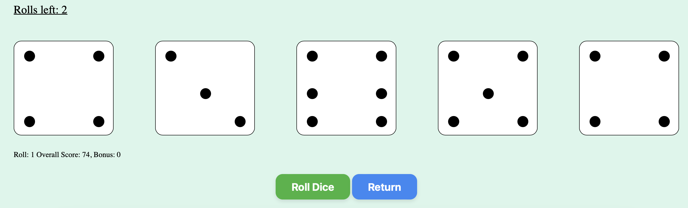

# CSI3140 - Yatzy Design System for Yatzy V-03 

This document outlines the design choices that were made in the development of A&T's Yatzy, which will include a brief discussion on the different components of the UI and the code. 

> Developed by **Tolu Emoruwa & Ali Bhangu**

## Overview: 
Welcome to A&T's Yatzy, in our version of this game, you have 3 total rolls, one inital roll and two re-rolls. You can select from amongst the dice and keep the selected ones. 

<picture>
    
</picture>

## Structural Component Breakdown 

### HTML  & CSS
Within our HTML file we display our 'game board', the 5 slots for our dice. The html page is coded to adapt to the 5 dice containers. It also has a write up defining the rules of the game for our player. There are also buttons and a header that we followed through from our portfolio site, which are used to return to the previous page or to then play the game. 

We have our header and the game section, we did not include an footer for our yatzy game as we felt it was redundant. 

- **Primary Font:** 'Franklin Gothic Medium', 'Arial Narrow', Arial, sans-serif;

#### Header
Our header used is the same one we utilized in our assignment 1, to keep thematic consistencies especially after implementing the game within our projects of the portfolio. 

 

##### Header Colors: 
- **Primary Colour:** #333 - Black 
- **Border Colour:** #77a0a2 - Weldon Blue

---

#### Game Board 

##### Colours
- **Primary Colour:** Azureish White
- **Primary Colour Hex Code:** #DAF6EA
- **Primary Color Usage:** Background Colour 

- **Roll Button Colour:** Green
- **Roll Button Colour Hex Code:** #37b33d
- **Roll Button Colour Usage :** Button used for rolling the Dice 

- **No More Rolls Button Colour:** Light Pink
- **No More Rolls Button Colour Hex Code:** #FFB6C1
- **No More Rolls Button Colour Usage :** Button used to not allow anymore dice rolls. 

- **Back Button Colour:** Blue
- **Back Button Colour Hex Code:** #3089f5
- **Back Button Colour Usage :** Button used for the back button 

- **Accent Colour:** Orange - Red
- **Accent Colour Hex Code:** FF4500
- **Accent Colour Usage:** Used to highlight the borders of selected die

These colors are used because they appeal to the viewers eyes. We used complimenting colors to utilize color theory to help the flow of our website. 

---
## Database
We utilized a MySQL database for the A&T Yatzy core game data, the data includes some previous plays and scores from players. 

1. **Database Queries and Creation**

---
## JavaScript
Our JavaScript implementation for A&T's Yatzy manages the core game logic, including dice rolls, score calculations, and UI interactions. Below is a summary of the main components and their functionalities:
JavaScript

1. **Roll Management**
Purpose: Handles dice rolls and updates the number of rolls left.
Key Methods:
- rollDice(): Rolls the dice and updates the game state accordingly.
- updateRollsLeftText(rolls): Updates the text indicating the number of rolls left.

2. **Dice Management**
Purpose: Manages the selection and visual representation of dice.
Key Methods:
- toggleKeepDice(index): Toggles whether a specific die is kept.
- clearDots(dice): Clears the current dots from a die.
- addDot(dice, className): Adds a dot to a die.
- showDiceNumber(dice, number): Displays the appropriate dots on a die based on its value.

3. **Leaderboard Management**
Purpose: Maintains and displays the top 10 highest scores.
Key Functions:
- updateGameState(data): Updates the game state with the latest roll data and manages the leaderboard.
- displayLeaderboard(): Creates and appends list items for each score in the highest scores array.

**Event Listeners**:
- Roll Button: Initiates dice rolls and updates the UI accordingly.
- Dice Click: Toggles the 'kept' status of a die when clicked, visually indicating which dice are held.
- This structure ensures the game logic is well-organized and the UI is responsive to user interactions, providing an engaging and intuitive gameplay experience. Feel free to take a look at the JavaScript files in the yatzy folder.